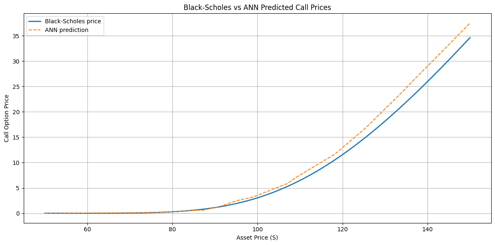

# Black-Scholes Neural Network

This project explores the capability of neural networks to learn and approximate the Black-Scholes option pricing model. The goal is to investigate whether artificial intelligence can effectively learn complex financial pricing models and potentially capture additional market dynamics that the traditional Black-Scholes model might miss.

## Project Overview

The Black-Scholes model is a fundamental mathematical model used for pricing European-style options. While it provides an elegant closed-form solution, it relies on several assumptions that may not hold in real markets (constant volatility, continuous trading, no transaction costs, etc.).

This project aims to:
1. Implement the traditional Black-Scholes model
2. Generate synthetic option pricing data
3. Train a neural network to learn the Black-Scholes pricing function
4. Compare the neural network's predictions with theoretical prices
5. Expose the trained model via REST API

## Technical Stack

- **Python**: Primary programming language
- **NumPy**: For numerical computations and array operations
- **SciPy**: For statistical functions and cumulative normal distribution
- **PyTorch**: For neural network implementation

## Mathematical Background

The Black-Scholes formula for European call options is:

**Call Option Price:**
$$
C = S e^{-qT} \Phi(d_1) - K e^{-rT} \Phi(d_2)
$$

**Where:**
$$
d_1 = \frac{\ln(S / K) + \left(r - q + \frac{1}{2}\sigma^2\right) T}{\sigma \sqrt{T}}, \quad
d_2 = d_1 - \sigma \sqrt{T}
$$

- S₀: Initial stock price
- K: Strike price
- T: Time to maturity
- r: Risk-free rate
- σ: Volatility
- N(·): Cumulative normal distribution function

**Assumptions:**
* The asset follows a geometric Brownian motion with constant volatility.
* The risk-free rate r, volatility \sigma, and dividend yield q are constant.
* The option is European-style (exercisable only at expiration).
* The model does not use implied volatility; it assumes volatility is known and constant.

## Setup and Installation

### Using Docker (Recommended)

1. Build the Docker image:
```bash
docker build -t black-scholes-nn .
```

2. Run the container:
```bash
docker run -p 8000:8000 black-scholes-nn
```

This will:
- Generate the training data
- Train the neural network model
- Start the FastAPI server on port 8000

### Manual Setup

1. Create a virtual environment:
```bash
python -m venv venv
source venv/bin/activate 
```

2. Install dependencies:
```bash
pip install -r requirements.txt
```

3. Run the main script to generate dataset, train model, and evaluate:
```bash
python main.py
```

4. Start the API server:
```bash
uvicorn main:app --host 0.0.0.0 --port 8000
```

## Workflow

The project follows this workflow:

1. **Data Generation** (`src/data_generation.py`):
   - Generates synthetic option pricing data
   - Creates training and validation datasets
   - Saves data to CSV files in the `data/` directory

2. **Model Training** (`src/train.py`):
   - Loads the training data
   - Trains the neural network to approximate Black-Scholes
   - Saves the trained model to `models/model.pth`

3. **Model Evaluation** (`src/evaluate.py`):
   - Evaluates model performance on test data
   - Generates performance metrics and comparisons

4. **API Service**:
   - Provides REST endpoint for option price predictions

## Using the API

Once the server is running, you can make predictions using the following curl command:

```bash
curl -X POST "http://127.0.0.1:8000/predict" \
     -H "Content-Type: application/json" \
     -d '{"S": 100, "K": 120, "q": 0.01, "r": 0.05, "sigma": 0.3, "t": 0.5}'
```

Parameters:
- `S`: Current stock price
- `K`: Strike price
- `q`: Dividend yield
- `r`: Risk-free rate
- `sigma`: Volatility
- `t`: Time to maturity (in years)

## Results & Conclusions

After training the neural network, the model achieved the following metrics:

| Metric | Value   |
|--------|---------|
| **Mean Absolute Error (MAE)** | 0.1952  |
| **Root Mean Squared Error (RMSE)** | 0.3047 |

The plot below compares the predicted call option prices from the neural network (ANN) with the theoretical Black-Scholes prices:



The neural network closely tracks the Black-Scholes formula across a range of asset prices, demonstrating that a well-trained ANN can effectively learn the Black-Scholes mapping. However, some deviations are visible, especially for higher asset prices, which may be due to the network's capacity, data distribution, or the inherent limitations of the Black-Scholes model itself.

**Conclusion:**  
While the Black-Scholes model provides a solid theoretical foundation for option pricing, it relies on simplifying assumptions such as constant volatility, log-normal price dynamics, and frictionless markets. These assumptions often do not hold in real financial markets, leading to pricing errors. Neural networks, on the other hand, offer a flexible, data-driven approach that can potentially capture more complex, nonlinear relationships present in real-world data. This project demonstrates that neural networks can approximate the Black-Scholes formula with high accuracy, and opens the door to further research where ANNs are trained on real market data to capture features and risks that traditional models may overlook. 

## Inspiration/References

- https://digitalcommons.usu.edu/cgi/viewcontent.cgi?article=2513&context=gradreports
- https://youtu.be/aRr3chiwkrI
- https://quant-next.com/artificial-neural-network-for-option-pricing-with-python-code/